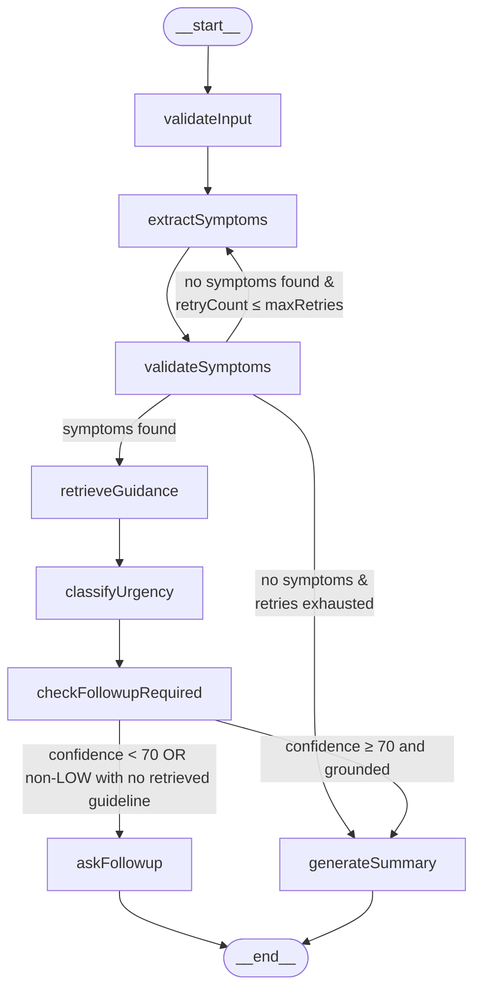

# Medical AI Assistant

A full-stack medical triage assistant that collects patient-reported symptoms, uses a local Ollama model to extract symptoms and classify urgency, asks follow-up questions when confidence is low, and returns a concise clinical summary.

## Features

- React + TypeScript frontend for symptom intake and follow-up questions.
- Express + Node.js + TypeScript backend API.
- LangGraph stateful workflow for symptom processing with retry and conditional routing.
- Local Ollama inference using the `llama3.2` model.
- Lightweight local RAG grounding with synthetic triage guidelines and citations.
- SQLite persistence for assessment sessions and graph checkpoints.
- Urgency classification: `LOW`, `MEDIUM`, or `HIGH`.
- Clinician-friendly summary generation.
- Automatic follow-up questions when model confidence is below 70%.

## Project Structure

```text
medical-ai-assistant/
  backend/
    src/
      app.ts                   # Express app entry point
      routers/router.ts        # API routes
      controller/controller.ts # Request handlers and graph orchestration
      graph/
        graph.ts              # LangGraph workflow definition
        state.ts              # Shared graph state schema
        nodes/
          validateInput.ts    # Rejects empty input
          extractSymptoms.ts  # LLM symptom extraction
          validateSymptoms.ts # Validates extracted symptoms, handles retries
          retrieveGuidance.ts # Retrieves top synthetic guideline matches
          classifyUrgency.ts  # LLM urgency + confidence classification
          requireFollowup.ts  # Decides if follow-up is needed (low confidence or ungrounded non-LOW case)
          askFollowup.ts      # Generates follow-up questions
          generateSummary.ts  # Produces final clinical summary
      retrieval/
        guidelines.ts         # Synthetic demo triage guideline corpus
        retriever.ts          # Local embeddings + cosine similarity search
      db/
        dbSetup.ts            # SQLite schema and initialization
        checkpointer.ts       # Graph checkpoint storage (save/resume nodes)
      utils/
        ollamaClient.ts       # Shared Ollama client instance
        constant.ts           # Graph node name constants
        sessionHelper.ts      # SQLite session CRUD helpers
    package.json
    tsconfig.json
    medical_sessions.db       # SQLite database, created at runtime
  frontend/
    src/
      App.tsx                 # Main UI state machine (input → followup → summary)
      api/client.ts           # Typed backend API client
      components/
        SymptomForm.tsx       # Initial symptom input form
        FollowupForm.tsx      # Follow-up questions form
        SummaryView.tsx       # Final clinical summary display
        LoadingSpinner.tsx    # Loading state
    package.json
    vite.config.ts
```

## Tech Stack

**Frontend**

- React 19
- TypeScript
- Vite
- ESLint

**Backend**

- Node.js
- Express 5
- TypeScript (`tsx` for development)
- LangGraph (`@langchain/langgraph`)
- Ollama JS client
- better-sqlite3

## Prerequisites

- Node.js 22+ and npm
- [Ollama](https://ollama.com/) installed and running locally
- The `llama3.2` model pulled in Ollama

Pull the model:

```bash
ollama pull llama3.2
```

Start Ollama before running the backend. The backend expects Ollama at `http://localhost:11434`.

## Setup

Install backend dependencies:

```bash
cd backend
npm install
```

Install frontend dependencies:

```bash
cd ../frontend
npm install
```

## Running Locally

Start the backend API:

```bash
cd backend
npm run dev
```

The backend runs on: http://localhost:3000

Start the frontend in another terminal:

```bash
cd frontend
npm run dev
```

The frontend runs on: http://localhost:5173

Open the frontend URL in your browser and submit a symptom description.

## Graph Diagram

The diagram below reflects the compiled LangGraph topology — nodes, conditional branches, and the retry loop.



## Architecture

```text
User Input
    │
    ▼
React Frontend
    │  POST /chat
    ▼
Express API
    │
    ▼
LangGraph Workflow
    │
    ├─ validateInput
    │       │
    ├─ extractSymptoms ◄──────────────┐
    │       │                         │ retry if no symptoms
    ├─ validateSymptoms ──────────────┘ and retryCount ≤ maxRetries
    │       │
    │  (symptoms found)
    │       │
    ├─ retrieveGuidance
    │       │
    ├─ classifyUrgency
    │       │
    ├─ requiresFollowup-----------
    │       │                    |
    │  confidence ≥ 70 and grounded
    │                 confidence < 70 OR non-LOW without retrieval grounding
    │       │                    │
    ├─ generateSummary     askFollowup
    │       │                    │
    │       │            API response with questions
    │       │            (frontend submits answers)
    │       │            POST /followup/answers
    │       │                    │
    │       │            classifyUrgency (re-run)
    │       │                    │
    │       └────────────generateSummary
    │                            │
    ▼                            ▼
    SQLite (sessions + checkpoints)
              │
              ▼
API Response → React Frontend
```

## State Schema

The graph state is defined in [backend/src/graph/state.ts](backend/src/graph/state.ts) using `Annotation.Root`. Every node reads from and/or writes to this shared object.

| Field | Type | Written by | Description |
|---|---|---|---|
| `patientInput` | `string` | `validateInput` | Raw symptom description entered by the patient, trimmed of whitespace. |
| `sessionId` | `string` | Controller (at invocation) | UUID that identifies the session across the HTTP boundary. |
| `symptoms` | `string[]` | `extractSymptoms`, `validateSymptoms` | Symptom strings extracted from `patientInput`. Empty until extraction succeeds. |
| `retrievedGuidelines` | `{id: string; text: string; score: number}[]` | `retrieveGuidance` | Top similarity-matched synthetic guideline snippets used to ground urgency classification. |
| `citedGuidelineIds` | `string[]` | `classifyUrgency` | Guideline IDs cited by the urgency classifier as evidence for its decision. |
| `followupQuestions` | `string[]` | `askFollowup` | 1–3 clarifying questions generated when confidence is below 70. |
| `followupAnswers` | `string[]` | Controller (`processFollowupAnswers`) | Patient's answers to the follow-up questions, submitted via `POST /followup/answers`. |
| `requiresFollowup` | `boolean` | `checkFollowupRequired` | `true` when `confidence < 70`, or when no guideline was retrieved for a non-LOW urgency case. |
| `urgency` | `"LOW" \| "MEDIUM" \| "HIGH"` | `classifyUrgency` | Urgency tier returned by the model. |
| `confidence` | `number` | `classifyUrgency` | Integer 0–100 representing the model's confidence in the urgency classification. |
| `summary` | `string` | `generateSummary` | Final 2–3 sentence clinician-friendly summary incorporating symptoms and any follow-up context. |
| `symptomRetryCount` | `number` | `validateSymptoms` | Number of extraction attempts completed so far. Incremented each time symptoms come back empty. |
| `maxSymptomRetries` | `number` | Controller (at invocation, default `1`) | Upper bound on extraction retries before giving up and routing directly to summary. |

## API Endpoints

### `POST /chat`

Starts a new symptom assessment.

**Request body:**

```json
{
  "patientInput": "I have had fever and cough for 3 days"
}
```

**Response when confidence is sufficient (≥ 70):**

```json
{
  "sessionId": "uuid",
  "requiresFollowup": false,
  "urgency": "MEDIUM",
  "confidence": 75,
  "summary": "Patient reports fever and cough for 3 days..."
}
```

**Response when follow-up is needed (confidence < 70):**

```json
{
  "sessionId": "uuid",
  "requiresFollowup": true,
  "followupQuestions": [
    "How long have you had this?",
    "Is it getting worse?"
  ]
}
```

### `POST /followup/answers`

Submits answers for a session that required follow-up. Resumes the graph from `classifyUrgency` with the additional context.

**Request body:**

```json
{
  "sessionId": "uuid",
  "followupAnswers": [
    "It started 3 days ago",
    "It is getting worse"
  ]
}
```

**Response:**

```json
{
  "urgency": "HIGH",
  "confidence": 82,
  "summary": "Patient reports..."
}
```

## Assessment Workflow

The backend graph runs these steps in order:

1. **validateInput** — Rejects empty input immediately.
2. **extractSymptoms** — Uses Ollama to extract a JSON array of symptoms from free-text.
3. **validateSymptoms** — Normalizes symptoms. If none are found and the retry limit is not reached, loops back to `extractSymptoms`.
4. **retrieveGuidance** — Uses local embeddings (`Xenova/all-MiniLM-L6-v2`) and cosine similarity to fetch top synthetic guideline snippets (threshold `0.35`).
5. **classifyUrgency** — Uses Ollama to classify `LOW`, `MEDIUM`, or `HIGH` urgency with a 0–100 confidence score and returns cited guideline IDs.
6. **requiresFollowup** — Routes to follow-up if confidence is below `70`, or if urgency is not `LOW` and no guideline grounding was retrieved.
7. **askFollowup** (conditional) — Generates 1–3 clarifying questions and checkpoints the state. Returns questions to the client; waits for answers via `POST /followup/answers`.
8. **generateSummary** — Produces a 2–3 sentence clinician-friendly summary including grounding/citation context and saves a checkpoint.

## RAG / Grounding

- The triage grounding corpus is intentionally **synthetic/fabricated demo data** (not real clinical guidance).
- The backend embeds guideline snippets and symptom queries locally with `@xenova/transformers` using `Xenova/all-MiniLM-L6-v2`.
- Retrieval is in-memory cosine similarity over the small corpus, returning top matches above a `0.35` threshold.
- If no guideline is retrieved for a non-`LOW` urgency case, the flow escalates to follow-up/clinician review instead of returning a high-confidence ungrounded result.

## Database

The backend uses SQLite through `better-sqlite3`. The database file is created automatically in the `backend/` directory when the server first starts.

**Tables:**

| Table | Purpose |
|---|---|
| `sessions` | Stores full assessment state keyed by `sessionId` |
| `checkpoints` | Stores serialized graph state at key nodes for resumability |

The database file (`medical_sessions.db`) is local runtime data and is added to `.gitignore`.

## Hard-coded Service URLs

| Service | URL |
|---|---|
| Frontend → Backend | `http://localhost:3000` |
| Backend CORS allow-list | `http://localhost:5173` |
| Backend → Ollama | `http://localhost:11434` |

## What's Next/ Things left out

- **Auth + session ownership** — Add JWT or session cookies so patients can only access their own sessions; prevents enumeration of other users' data via `sessionId`.
- **Automated tests** — Unit tests for each graph node (mock Ollama responses), integration tests for the full graph, and contract tests for the API. The current codebase has zero test coverage.
- **Streaming responses** — Stream the `generateSummary` output token-by-token to the frontend so users see progress during the longest LLM call instead of a spinner.
- **Replace the custom checkpointer with LangGraph's built-in `SqliteSaver`** — Removes ~80 lines of custom code, adds proper thread/config ID semantics, and enables true graph resumption (re-entering the graph mid-run rather than manually re-calling nodes).

## Trade-offs

| Decision | What was chosen | What was traded away |
|---|---|---|
| **Custom SQLite checkpointer** | Simple, zero-dependency persistence that works offline | LangGraph's built-in `SqliteSaver` would handle thread/config IDs, serialization, and TTL automatically |
| **Re-running nodes directly for follow-up** | `classifyUrgency` and `generateSummary` are called directly in the controller after follow-up answers arrive | Full graph replay via `graph.invoke` would keep all routing logic in one place and preserve complete traceability |
| **Local Ollama (`llama3.2`)** | No API cost, no data leaves the machine, works offline | Requires local setup; model quality is lower than GPT-4-class models; no streaming |
| **Confidence threshold hard-coded at 70** | Easy to reason about | Should be configurable per-deployment or per-symptom category |
| **No authentication** | Simpler to develop and demo locally | Not production-ready; any caller can read or overwrite any session ID ||

## Why LangGraph Instead of a Simple Chain

A simple chain calls the LLM once and returns a result. This app needs more: extract symptoms, check if they make sense, maybe retry, classify urgency, decide if the model needs more info, ask follow-up questions, then summarize — and only some of those steps run every time.

LangGraph handles that branching cleanly. Each step is a separate node, the shared state is typed, and the routing logic lives in explicit conditional edges rather than buried in prompts.